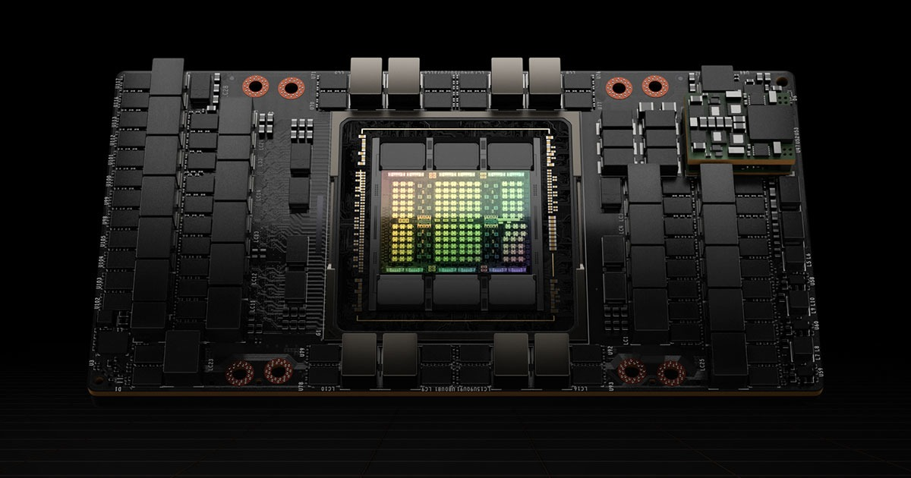

# Introduction

## Motivations

The field of applied statistics is fundamentally intertwined with computation. Throughout its endeavour to analyse and model data and derive meaningful patterns from it, it has to apply complex mathematical transformations which require significant computational power. This connection has become increasingly critical as we find ourselves in an era of unprecedented data proliferation. From the petabytes of genomic data in bioinformatics to the high-frequency trading data in computational finance and the vast, unstructured text of the internet, the sheer volume and complexity of information have grown exponentially across every domain of science and industry.

This data deluge has catalysed a shift toward more sophisticated statistical methods. Simple linear models, once the bedrock of statistical analysis, often fall short of capturing the intricate, non-linear relationships hidden within these massive datasets. Consequently, practitioners are increasingly adopting more flexible and computationally demanding techniques to extract meaningful insights and power their applications.

However, this progress hinges on a critical trade-off that introduces a significant challenge: the very complexity that makes these models so effective also renders them enormously demanding on computational resources. The practical application of a state-of-the-art algorithm on a dataset with millions or billions of data points can transform a minutes-long analysis into a process that takes hours, days, or becomes entirely intractable. This computational bottleneck hinders the pace of research and the deployment of cutting-edge models in real-world applications. A statistical method, after all, is of little use if it cannot be practically applied.

Solving this computational bottleneck has necessarily required a parallel evolution in hardware. One of the most transformative breakthroughs in this evolution has been the Graphics Processing Unit (GPU). Since their mainstream introduction in the 1990s, the GPU's unique architecture provided the raw power needed to drive modern statistical techniques. Its impact over the last decade is particularly evident on the field of Artificial Intelligence, where the GPU has enabled the practical implementation and scaling of deep neural networks, a class of architectures that are themselves built upon foundational statistical principles.

This raises a critical question: if GPUs revolutionized AI by accelerating one class of statistical methods, what potential do they hold for the broader landscape of statistical computation? This work is motivated by a dual interest in statistics and computer science and investigates the implementation of diverse classes of statistical methods on GPUs. Our main hypothesis is that the widespread adoption of GPUs can usher in a new era of data analysis. Ultimately, this thesis aims to help bridge the gap between the ambition of modern statistical theory and the limits of current computational practices by leveraging the massive parallel processing power enabled by modern engineering.

## Historical Context

The evolution of computation is inextricably linked to the history of statistics. The two fields have co-evolved, with the need to analyse data and quantify uncertainty serving as a primary catalyst for innovation in calculation for centuries.

```{r antikythera, echo=FALSE, fig.cap="The Antikythera mechanism, an ancient analogue computer, demonstrates the long-held ambition to mechanize complex calculations.", fig.align='center', out.width='80%'}

```

Before the 20th century, the practice of statistics was defined by immense manual effort. Pioneers like Karl Pearson, who laid much of the theoretical groundwork for the modern field, conducted their work with pen, paper and logarithmic tables. As the field progressed with figures such as R. A. Fisher, the need to aid the process of calculation became increasingly evident. Yet, the early devices available at the time only automated individual calculations. The theoretical brilliance of those early statisticians was constrained by the painstaking labour required for every analysis, a reality that severely limited the scale and complexity of the problems they could address.

The ambition to overcome these manual constraints has a long history. Precedents for mechanical calculation, such as the Antikythera mechanism, date back to antiquity. However, the true conceptual predecessors to the modern computer emerged in the 19th century with Charles Babbage's Difference Engine and its more ambitious successor, the Analytical Engine. It was for this latter machine that Ada Lovelace wrote what is considered the first computer program, an algorithm to calculate Bernoulli numbers, demonstrating an early understanding that these machines could transcend simple arithmetic and automate complex sequences of calculations.

```{r hollerith-tabulator, echo=FALSE, fig.cap="Herman Hollerith's electromechanical tabulating machine, created to solve the 1890 U.S. Census crisis and marking a key step in automated data processing.", fig.align='center', out.width='50%'}

```

Practical needs soon drove further innovation. The daunting challenge of processing the 1890 U.S. Census became the first major application of automated data processing. Faced with a data problem that would have taken over a decade to analyse by hand, Herman Hollerith developed an electromechanical tabulating machine that reduced the task to a matter of months. The success of his invention led to the company that would eventually become IBM. Yet, the true turning point arrived a few decades later. The foundational principles of computation from figures like Alan Turing converged with the urgent, immense computational demands of World War II. This led directly to the development of the first general-purpose electronic computers, such as ENIAC, launching the modern computing age.

The post-war era was dominated by the *von Neumann* architecture, which established the Central Processing Unit (CPU) and its sequential model as the heart of the computer. This new paradigm of programmable machines, along with the creation of the first high-level languages designed for scientific computing like *Fortran*, directly enabled the birth of statistical software. At research hubs like Bell Labs, the development of the powerful *C* programming language provided tools to write not only the Unix operating system but also foundational statistical packages like *S*, the predecessor to *R*. For decades, the field advanced in lockstep with Moore's Law, as ever-faster CPUs from companies like Intel, supported by numerical libraries like BLAS, allowed for the analysis of progressively larger datasets.

```{r personal-computer, echo=FALSE, fig.cap="The personal computer democratized computation, enabling statisticians to run powerful software like R and Python directly from their desks.", fig.align='center', out.width='100%'}

```

By the mid-2000s, however, the physical limitations of silicon brought the era of exponential clock speed improvements to an end. To continue increasing performance, the industry pivoted from making single cores faster to putting multiple cores on a single chip. For statisticians and programmers alike, the "free lunch" of automatically faster software was over. To harness the power of new hardware, algorithms themselves now had to be re-engineered for parallel execution.

It was in this new landscape that the GPU emerged as a transformative force. Originally a niche component designed for rendering video game and cinema graphics by companies like NVIDIA, it was soon discovered that its architecture, built to perform simple calculations on millions of pixels in parallel, was perfectly suited for the data-parallel tasks that defined modern computational statistics. Today, GPUs are at the epicentre of the AI revolution, powering the training and inference of massive generative models, such as Large Language Models (LLMs).

```{r nvidia-h100, echo=FALSE, fig.cap="The NVIDIA H100 Tensor Core GPU, an architecture designed for massively parallel computation, which has become foundational for training large-scale artificial intelligence models.", fig.align='center', out.width='60%'}

```

```{r gpu_computing, child = '01a-gpu-intro.Rmd'}
```

```{r thesis_objectives, child = '01b-objectives.Rmd'}
```
