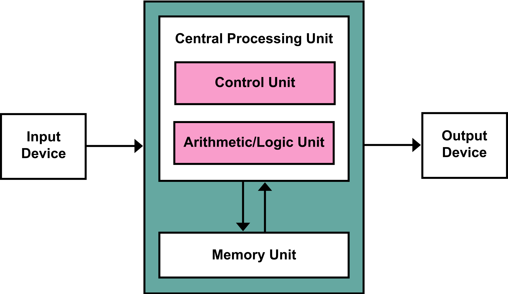
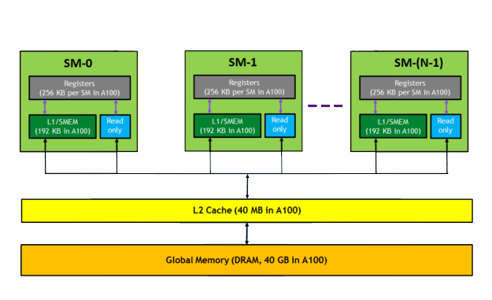

## Foundations of the GPU Architecture

The transformative potential of the Graphics Processing Unit (GPU) in accelerating complex statistical calculations stems from its massively parallel design. This section introduces the foundational ideas which are required to appreciate the paradigm shift enabled by the GPU. We examine the key distinctions between the CPU and the GPU, explore the GPU's execution model and memory hierarchy, and conclude by discussing the software abstractions that make its power accessible for statistical computing.

### The *von Neumann* architecture and the GPU

The foundation of modern computing is the *von Neumann* architecture, a model centred around a Central Processing Unit (CPU), a unified Memory Unit for both program instructions and data, and Input/Output (I/O) devices, all interconnected by buses. A key characteristic of this design is its specific memory hierarchy and its approach to computation, which is primarily done sequentially, one instruction at a time.

Within this architecture, the CPU is engineered for low-latency access and the rapid execution of a single task or a few concurrent tasks. CPU cores are complex and powerful, equipped with sophisticated control flows and large cache memories. To optimize performance and handle diverse, general-purpose workloads effectively, CPUs employ techniques such as branch prediction and speculative execution, which are crucial for minimizing latency in sequential instruction streams.

```{r von-neumann-architecture, echo=FALSE, fig.cap="Scheme of the standard von Neumann architecture.", fig.align='center', out.width="80%", fig.pos='H'}

```

A significant limitation of this design is the *von Neumann* bottleneck. This arises because program instructions and data share the same memory space and the same buses to transit *to* and *from* the CPU. Consequently, they cannot be fetched simultaneously, often forcing the CPU to wait for data or instructions to be transferred from memory, thereby constraining overall processing speed.

To address this limitation, particularly for computationally intensive tasks, the GPU emerged to augment the *von Neumann* model. GPUs act as specialized, massively parallel co-processors allowing the CPU to offload specific types of workloads. This enables the CPU to focus on its strengths: general-purpose computations, sequential tasks, and overall system management.

```{r cpu-gpu-comparison, echo=FALSE, fig.cap="Comparison between CPU and GPU architecture.", fig.align='center', out.width="80%", fig.pos='H'}
knitr::include_graphics("img/chapter_1/cpu_gpu_comparison.png")
```

GPUs help overcome the *von Neumann* bottleneck for suitable tasks by being throughput-oriented. They are engineered for high computational throughput on problems that can be broken down into many independent operations that can be performed simultaneously. This is achieved through a massively parallel architecture. Instead of a few powerful cores like a CPU, a GPU contains hundreds or even thousands of simpler cores. In NVIDIA technology, which we explore on this thesis, these cores are typically grouped into Streaming Multiprocessors (SMs), where each SM acts as an independent processor. This design allows a single GPU to manage and execute thousands of threads concurrently.

Furthermore, GPUs feature dedicated high-bandwidth memory (VRAM), which is optimized for the rapid access and manipulation of large datasets. This dedicated memory allows the GPU to perform its computations without constantly contending with the CPU for access to the main system memory (RAM), thereby bypassing the primary bottleneck for those specific, data-parallel operations.

While GPUs offer this immense parallel power, their design involves trade-offs. They have smaller local memory per processing unit compared to CPU caches, and data transfers between RAM and the GPU's VRAM can be slow relative to the GPU's internal computational speed. However, for tasks where the GPU excels, the significant speedup from parallel processing often far outweighs the latency introduced by inbound and outbound data transfers.

In this augmented model, the CPU often acts as an orchestrator, managing the workflow and delegating parallelizable portions to the GPU. The GPU executes the computation and returns the results to main memory for the CPU to utilize. Thus, GPUs don't fundamentally replace the *von Neumann* architecture, but extend it to create a powerful heterogeneous computing environment. CPUs continue to excel at complex sequential logic and task management, while GPUs provide the muscle for massive parallel computation, allowing modern systems to tackle increasingly demanding computational challenges.

### GPU Parallel Execution Model {#gpu-intro}

GPUs primarily use the Single Instruction, Multiple Thread (SIMT) model. This paradigm allows a single instruction to be issued to a large number of threads, which then execute it concurrently, each operating on distinct data. While building upon principles seen in earlier Single Instruction, Multiple Data (SIMD) architectures, SIMT offers greater flexibility in managing thread execution.

```{r cuda-kernel-execution, echo=FALSE, fig.cap="Correlation between CUDA programming paradigms and hardware conventions.", fig.align='center', out.width="80%", fig.pos='H'}
knitr::include_graphics("img/chapter_1/cuda_kernel_execution.png")
```

Code designed for GPU execution is encapsulated within a *kernel*, which is essentially a function compiled to run on the GPU *device*. When the *host* CPU launches a kernel, it defines a grid of thread blocks. Each thread block, in turn, is composed of individual threads. All threads within this grid execute the same kernel code. However, each thread possesses a unique identifier (its thread ID), enabling it to access different data elements and follow distinct execution paths within the kernel, allowing for diverse computations despite running the same core program.

The execution of these threads is managed by the SMs on the GPU. Within each SM, threads are organized and scheduled in groups of 32, known as warps. An SM issues instructions to an entire warp at a time, meaning all 32 threads in a warp execute the same instruction in lockstep during a given cycle.

This lockstep execution is highly efficient for uniform computations. However, if threads within a warp encounter a conditional branch in the code and attempt to take different execution paths, a phenomenon termed branch divergence, the SM typically handles this by serializing the execution of the different paths. This serialization can severely impact performance, making it beneficial to write code that minimizes divergence within a warp.

To manage the high latency of operations like accessing global memory access, SMs are designed for latency hiding. If one warp stalls, for instance, while waiting for data to be fetched from global memory, the SM can rapidly context-switch to another warp that is ready to execute. This ability to hide latency by interleaving the execution of many active warps is a cornerstone of GPU performance because it ensures that the processing units remain highly utilized. Consequently, launching a sufficient number of warps, often organized into multiple thread blocks per SM, is crucial for achieving optimal throughput.

It is important to understand that the execution order of threads or even entire thread blocks is not guaranteed. Without explicit synchronization mechanisms employed by the programmer, there is no way to know when one block will execute relative to another. This inherent parallelism requires careful algorithm design to correctly manage any dependencies between threads in different blocks.

### GPU Memory Hierarchy {#gpu-memory}

Effective data management is crucial for achieving high performance on GPUs, due to the potential bottlenecks from memory access latency and bandwidth. GPUs feature a distinct and complex memory hierarchy designed to feed their massively parallel processing units. As outlined by authors such as @zhang2015, the detailed characteristics of this hierarchy can significantly impact performance and may not always be fully disclosed by vendors. A comprehensive understanding of this hierarchy is paramount for optimizing statistical algorithms for GPU execution. An illustrative example of a modern accelerator, the NVIDIA A100 GPU, is depicted in Figure \@ref(fig:gpu-memory-hierarchy).

```{r gpu-memory-hierarchy, echo=FALSE, fig.cap="Simplified view of the memory hierarchy of an NVIDIA A100 40GB GPU.", fig.align='center', out.width="80%", fig.pos='H'}

```

The primary levels of this hierarchy are as follows:

1. **Global Memory (VRAM)**: The largest component of GPU memory, often several gigabytes (e.g., NVIDIA A100 features 40GB or 80GB of high-bandwidth DRAM). It is directly accessible by all processing threads and the host CPU. As an off-chip resource, VRAM exhibits the highest access latency. To utilize its high bandwidth efficiently requires what is called coalesced memory access, meaning simultaneous access to contiguous memory locations by threads in a warp. Uncoalesced access can severely degrade performance.
2. **L2 Cache**: A shared L2 cache resides on-die and helps reduce the average latency of global memory accesses. It services requests from all SMs, and transparently caches frequently used data to improve overall performance.
3. **Per-SM On-Chip Memory**: Each SM contains several faster, lower-latency memory resources on-chip.
  * **Registers**: The fastest memory type, private to each thread and located directly on the SM. They are crucial for holding frequently accessed variables, and compilers aim to maximize their use. Efficient intra-warp communication can also be achieved via register data exchange using shuffle instructions.
  * **L1 Cache / Shared Memory**: A per-SM fast on-chip memory resource that typically serves as both a hardware L1 cache for global memory accesses and as a programmer-managed Shared Memory. Shared memory offers low-latency, high-bandwidth access for threads *within the same block*, making it invaluable for explicit data sharing, inter-thread communication, and a user-controlled cache to reduce global memory traffic. The balance between L1 cache and shared memory capacity is often configurable.
  * **Read-Only Data Caches**: Dedicated read-only caches also exist within each SM for specific data access patterns. Constant Memory efficiently broadcasts identical values to multiple threads, while Texture Memory is optimized for read-only access with spatial locality, often providing hardware-accelerated interpolation.
4. **Local Memory**: Thread-private data that does not fit into registers (e.g., large arrays) is placed in Local Memory. Despite its name, local memory typically resides in the slow off-chip global memory, so its extensive use can significantly hinder performance and should be avoided where possible.

The design of this memory hierarchy is critically dependent on the principle of latency hiding. As previously discussed, the hardware's ability to manage and rapidly switch between thousands of concurrent threads is what allows it to tolerate the high latency of off-chip global memory. This ensures that the computational units remain highly utilized.

Finally, data transfers between the host's (CPU) system memory (RAM) and the device's (GPU) global memory (VRAM), conducted over the PCIe bus, represent another critical performance consideration. These transfers can become a significant bottleneck if not managed efficiently, for example, by minimizing their frequency and maximizing the amount of data moved per transfer. A strategic exploitation of this entire memory hierarchy is indispensable for developing GPU-accelerated solutions.

### GPU Programming Software Abstractions

The raw computational power of the GPU is made accessible to developers through layers of software abstractions. The most fundamental of these is **CUDA** (Compute Unified Device Architecture), NVIDIA's proprietary parallel computing platform, which allows developers to write **kernels**, which are functions executed on the GPU, in familiar languages like C++. CUDA offers fine-grained control over thread management and memory allocation. For broader hardware support, **OpenCL** provides an open, cross-platform standard for heterogeneous computing. An ecosystem of highly optimized libraries is built on top of these, such as NVIDIA's CUB and Thrust, which provide efficient primitives for common parallel operations like reduction, scanning, and sorting.

For most data scientists and statisticians, however, direct interaction with these low-level APIs may not always be necessary. The widespread adoption of GPUs in machine learning has led to the development of sophisticated high-level libraries, most notably **PyTorch** and **TensorFlow**. These frameworks provide intuitive, Python-based interfaces that abstract away the complexities of kernel writing and memory management. They allow practitioners to define complex models and computations using familiar tensor operations, while the framework's backend automatically translates these operations into optimized GPU kernels. This accessibility has been instrumental in democratizing high-performance computing, enabling researchers to leverage the full power of GPUs without needing to be experts in parallel programming.
