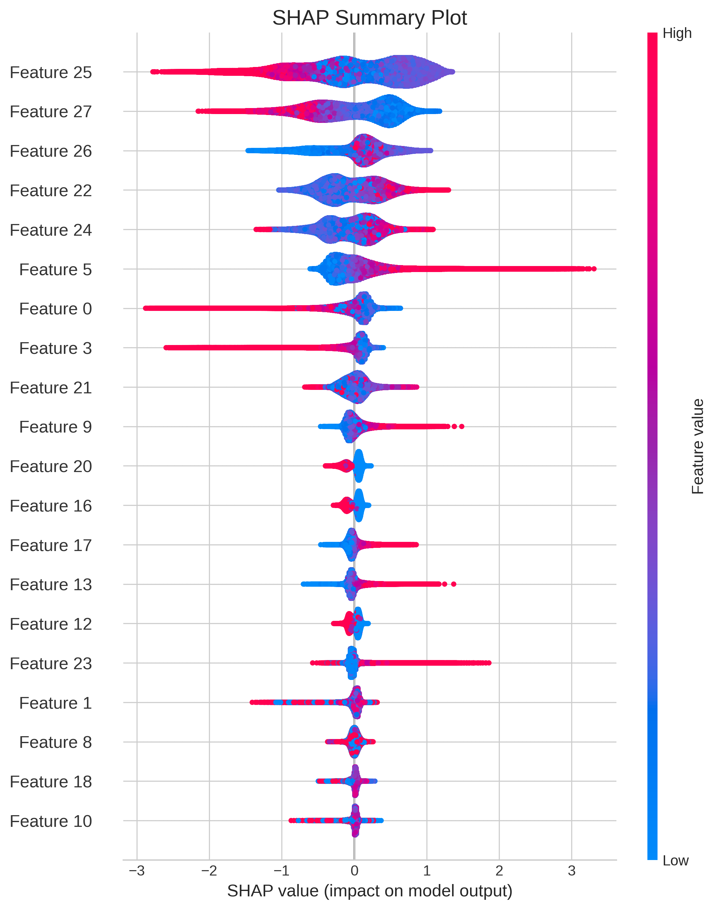

## Extreme Gradient Boosting on GPU with XGBoost

This section provides an empirical analysis of XGBoost, a state-of-the-art gradient boosting library. We evaluate the performance of its GPU-accelerated `hist` tree construction method, `gpu_hist`, detailed in Section \@ref(gpu-hist), on the large-scale HIGGS Boson classification dataset. This case study aims to demonstrate the practical speedups achieved by offloading the demanding tasks of gradient calculation and histogram aggregation to parallel hardware, validating the theoretical shift from a compute-bound to a memory-bandwidth-bound algorithm.

### Introduction to the XGBoost Library

XGBoost is an open-source Python library that has become a cornerstone in modern applications of computational statistics due to its state-of-the-art performance. As detailed in the previous chapter, its sophisticated algorithms entail significant computational demands that stem from sequential tree construction, exhaustive split finding, and extensive gradient computations. This section showcases how GPU acceleration, particularly the CUDA-based implementation introduced by @Mitchell2017, offers a tangible solution to these bottlenecks.

The underlying XGBoost system is built on a robust C++ core and integrates seamlessly with Python via its Scikit-learn compatible API. For GPU acceleration, the critical tree construction algorithms are executed entirely on the GPU, thus fully leveraging NVIDIA's CUDA toolkit for memory-efficient and high-speed processing. It is designed for high performance across various datasets and settings, including those with sparse input matrices. GPU-accelerated functionality is available as a plug-in within the standard XGBoost library supporting typical features like classification, regression and ranking with minimal syntactic changes.

### Experimental Setup

#### Software Configuration

The general benchmarking protocol outlined earlier has been applied here as well, in order to empirically quantify the performance advantages and practical utility of GPU acceleration for XGBoost. The experiments were conducted on a Google Colab environment using the software versions listed below:

* **XGBoost**: 2.1.4
* **PyTorch**: 2.6.0 (with CUDA 12.4 support)
* **Scikit-learn**: 1.6.1
* **NumPy**: 2.0.2
* **Pandas**: 2.2.2

#### Implementations Compared

To provide a comprehensive performance picture, five distinct implementations of gradient boosting were compared. These corresponding to the split-finding algorithms analyzed in Chapter 2:

1. **XGBoost (GPU, `hist`)**: The GPU-accelerated configuration using the histogram method (`tree_method = 'hist'`, `device = 'cuda'`), which is the primary focus of this case study.
2. **XGBoost (CPU, `hist`)**: A direct multi-core CPU baseline of the same efficient histogram algorithm (`tree_method = 'hist'`, `n_jobs = -1`)
3. **XGBoost (CPU, `approx`)**: The CPU-based **Approximate Greedy Algorithm** (`tree_method = 'approx'`), which uses a weighted quantile sketch to propose candidate splits.
4. **XGBoost (CPU, `exact`)**: The original CPU-based **Exact Greedy Algorithm** (`tree_method = 'exact'`), which relies on sorting and represents the computational wall described in Section 2.3.2.
5. **Scikit-learn (CPU)**: A baseline using the standard `GradientBoostingClassifier` from `scikit-learn` for a broader comparison against other popular implementations.

#### Hyperparameter Configuration

To isolate the impact of the algorithm and hardware, a consistent set of hyperparameters was used for all runs. These parameters were chosen based on common practices for the HIGGS dataset to ensure a realistic and robust benchmark. Each parameter is directly linked to the theoretical framework established in Chapter 2.

- **Objective** (`objective`): `'binary:logistic'`, specifying the differentiable loss function $L(y, \hat{y})$ to be minimized.
- **Evaluation Metric** (`eval_metric`) `'auc'`, the metric used for evaluation during training.
- **Learning Rate** (`eta`): $\eta$ set to `0.05`, controlling shrinkage applied to each new tree as shown in Equation \@ref(eq:gradient-boosting).
- **Number of Estimators** (`n_estimators`): `300` trees, defining the total size ($M$) of the ensemble.
- **Maximum Tree Depth** (`max_depth`): Set to `7`, limiting the complexity of each individual tree, $h_m (\mathbf{x})$.
- **Subsample Ratios** (`subsample`, `colsample_bytree`): Set to `0.7` for both row sampling and feature sampling, aiding regularization as inspired by the Random Forest methodology @Breiman2001.
- **Regularization** (`gamma`, `lambda`, `alpha`): Regularization terms corresponding to the penalty terms in the objective function $\Omega(h_m)$ (Equation \@ref(eq:regularization-term)) were kept at their default values with $\gamma$ set `0`, $\lambda$ set to `1`, and $\alpha$ set to `0`.

### Benchmark: Scalability with Sample Size (*n*)

The primary benchmark for XGBoost was designed to measure how each of the five implementations scales as the number of training samples (*n*) from the HIGGS Boson dataset increases. The dataset was subsampled at various sizes, ranging from $10,000$ to $8,000,000$ instances, to record training and prediction times.

#### Execution Time and Resource Consumption

```{r}
paths_bm3 <- list.files("data/",
                        pattern = "benchmark_xgboost_higgs.csv",
                        full.names = TRUE)
xgb_bm <- rbindlist(lapply(paths_bm3, fread), fill = TRUE)

xgb_bm[, run_type := gsub("cpu", "CPU", model_label)]
xgb_bm[, run_type := gsub("cuda", "GPU", run_type)]
xgb_bm[, run_type := factor(run_type, c("XGBoost (GPU, hist)",
                                        "XGBoost (CPU, hist)",
                                        "XGBoost (CPU, approx)",
                                        "XGBoost (CPU, exact)",
                                        "Scikit-learn GBC (CPU)"))]


xgb_bm_mp <- merge(
  unique(xgb_bm[, .(n_samples, mp = "1")]),
  unique(xgb_bm[, .(run_type, mp = "1")]),
  allow.cartesian = TRUE
)[, -"mp"]
xgb_bm <- rbindlist(list(
  xgb_bm,
  xgb_bm
), use.names = TRUE, fill = TRUE)
xgb_bm <- xgb_bm[order(n_samples, run_type, na.last = TRUE), head(.SD, 1), by = .(run_type, n_samples)]
xgb_bm <- extract_mean_sd(xgb_bm, "train_times")
xgb_bm <- extract_mean_sd(xgb_bm, "pred_times")

xgb_bm <- xgb_bm[, .(
  n_samples, run_type, 
  train_time = train_times_mean, train_sd = train_times_sd,
  pred_time = pred_times_mean, pred_sd = pred_times_sd,
  auc, accuracy, f1_score
)]
```

```{r xgboost-inline-metrics, echo=FALSE, warning=FALSE}
# 1. XGBoost 'exact' vs. Scikit-learn
skl_max_samples <- xgb_bm[run_type == "Scikit-learn GBC (CPU)", max(n_samples)]
skl_max_time <- xgb_bm[n_samples == skl_max_samples & run_type %like% "Scikit-learn", train_time]
exact_skl_time <- xgb_bm[n_samples == skl_max_samples & run_type %like% "exact", train_time]
exact_skl_mult <- skl_max_time / exact_skl_time

# 2. XGBoost 'exact' vs. 'approx'
exact_max_samples <- xgb_bm[run_type %like% "exact", max(n_samples)]
exact_max_time <- xgb_bm[n_samples == exact_max_samples & run_type %like% "exact", train_time]
approx_exact_time <- xgb_bm[n_samples == exact_max_samples & run_type %like% "approx", train_time]
approx_exact_mult <- exact_max_time / approx_exact_time

# 3. XGBoost 'CPU hist' vs. 'approx'
hist_max_samples <- xgb_bm[run_type %like% "CPU, hist", max(n_samples)]
hist_max_time <- xgb_bm[n_samples == hist_max_samples & run_type %like% "CPU, hist", train_time]
approx_run_slower_than_hist <- xgb_bm[train_time > hist_max_time & run_type %like% "approx", .SD[which.min(train_time)]]
approx_hist_samples <- approx_run_slower_than_hist$n_samples

# 4. GPU 'hist' vs. CPU 'hist' & Overall GPU Performance
hist_exact_time <- xgb_bm[n_samples == exact_max_samples & run_type %like% "CPU, hist", train_time]
gpu_exact_time <- xgb_bm[n_samples == exact_max_samples & run_type %like% "GPU, hist", train_time]
gpu_hist_exact_mult <- hist_exact_time / gpu_exact_time

gpu_hist_time <- xgb_bm[n_samples == hist_max_samples & run_type %like% "GPU, hist", train_time]
gpu_hist_mult <- hist_max_time / gpu_hist_time

gpu_max_samples <- xgb_bm[run_type %like% "GPU, hist", max(n_samples)]
gpu_max_time <- xgb_bm[n_samples == gpu_max_samples & run_type %like% "GPU, hist", train_time]


# Formatting
skl_max_samples <- format(skl_max_samples, big.mark = ",")
skl_max_time <- sprintf("%.0f", skl_max_time)
exact_skl_time <- sprintf("%.0f", exact_skl_time)
exact_skl_mult <- as.integer(exact_skl_mult)

exact_max_samples <- format(exact_max_samples, big.mark = ",")
exact_max_time <- sprintf("%.0f", exact_max_time / 60) # Convert to minutes
approx_exact_mult <- sprintf("%.1f", approx_exact_mult)

hist_max_samples <- format(hist_max_samples, big.mark = ",", scientific = FALSE)
approx_hist_samples <- format(approx_hist_samples, big.mark = ",")

gpu_exact_time <- sprintf("%.2f", gpu_exact_time)
hist_exact_time <- sprintf("%.2f", hist_exact_time)
gpu_hist_exact_mult <- sprintf("%.1f", gpu_hist_exact_mult)
gpu_hist_mult <- sprintf("%.1f", gpu_hist_mult)
gpu_max_samples <- format(gpu_max_samples, big.mark = ",", scientific = FALSE)
gpu_max_time <- sprintf("%.0f", gpu_max_time)
```

The results of the scalability benchmark are presented in Table \@ref(tab:xgboost-bm-results). It captures the training time, prediction time, and the Area Under the Curve (AUC) score for each configuration across the different dataset sizes.

```{r xgboost-bm-results, echo=FALSE, warning=FALSE}
# Define column headers for the final table
col_headers <- c(
  "$n$", "Implementation",
  "Train Time (s)", "Pred. Time (s)", "AUC", "Accuracy", "$F_1$"
)

xgb_bm_table <- copy(xgb_bm)

line_positions <- cumsum(rle(as.character(xgb_bm_table$n_samples))$lengths)
line_positions <- line_positions[-length(line_positions)]

xgb_bm_table[, `Train Time` := sprintf("%.2f ± %.2f", train_time, train_sd)]
xgb_bm_table[, `Pred. Time` := sprintf("%.2f ± %.2f", pred_time, pred_sd)]
xgb_bm_table[run_type == "XGBoost (GPU, hist)", run_type := "\\textbf{XGBoost (GPU, hist)}"]
xgb_bm_table[run_type == "Scikit-learn GBC (CPU)", run_type := "Scikit-learn (CPU)"]

xgb_bm_table[, n_samples := format(n_samples, big.mark = ",")]

xgb_bm_final <- xgb_bm_table[, .(
  n_samples, run_type,
  `Train Time`, `Pred. Time`,
  auc, accuracy, f1_score
)]

kable(
  xgb_bm_final,
  format = "latex",
  booktabs = TRUE,
  longtable = TRUE,
  col.names = col_headers,
  align = "rlrrrrr",
  digits = 4,
  escape = FALSE,
  caption = "XGBoost Scalability Benchmark Results: A comparison of training time (s), prediction time (s), and key classification metrics for various Gradient Boosting implementations across varying sample sizes ($n$)."
) |>
  # Add a clean horizontal line between each group of n
  row_spec(line_positions, extra_latex_after = "\\midrule") |>
  kable_styling(latex_options = "repeat_header")
```

#### Analysis of Scalability and Speedup Factors

The results observed in Table \@ref(tab:xgboost-bm-results) and visualized in Figure \@ref(fig:xgboost-bm-scalability) provide a clear, multi-layered hierarchy of performance among the tested gradient boosting implementations. At the baseline, the standard Scikit-learn implementation is by far the most computationally expensive. The superiority of the XGBoost framework is immediately apparent, as even its slowest algorithm, the **Exact Greedy Algorithm** (`exact`), is significantly faster than Scikit-learn's `GradientBoostingClassifier`. At $n =$ `r skl_max_samples`, the `exact` method is over `r exact_skl_mult`$\times$ faster (`r skl_max_time`s vs. `r exact_skl_time`s).

However, the `exact` method's reliance on sorting leads to poor scaling, and it becomes impractical for larger datasets, with training time requiring nearly `r exact_max_time` minutes for `r exact_max_samples` samples. The **Approximate Greedy Algorithm** (`approx`) offers only a minor reprieve, proving to be roughly `r approx_exact_mult`$\times$ as fast as the `exact` method, but still struggling to scale effectively.

The most remarkable leap in performance comes from the **histogram-based algorithm** (`hist`). This method represents a fundamental algorithmic improvement, and this is underscored by a stunning observation: even on its CPU implementation, `hist` trains on `r hist_max_samples` data points faster than the `approx` method handles just `r approx_hist_samples`. This clearly demonstrates that the `hist` algorithm fundamentally breaks the computational bottlenecks that plague the earlier methods.

The final tier of performance is achieved by offloading the `hist` algorithm to parallel hardware. The GPU implementation of the histogram-based algorithm, `gpu_hist`, is substantially faster than its CPU counterpart at every data point. At n = `r exact_max_samples`, the GPU version completes training in just `r gpu_exact_time` seconds compared to the CPU version's `r hist_exact_time` seconds, a speedup of nearly `r gpu_hist_exact_mult`$\times$. This advantage widens with the dataset, growing to an `r gpu_hist_mult` $\times$ at the `r hist_max_samples` sample mark. The GPU-accelerated `hist` method successfully trains a model on `r gpu_max_samples` in just `r gpu_max_time` seconds, an achievement that highlights the transformative power of combining state-of-the-art algorithms with dedicated hardware acceleration.

```{r xgboost-bm-scalability, fig.cap = "Training time scalability comparison across XGBoost and Scikit-learn implementations using a log-scaled y-axis.", fig.width=8, fig.height=5.5, out.width="80%", fig.align='center'}
# Create the plot
ggplot(xgb_bm, aes(x = factor(n_samples), y = train_time, fill = run_type)) +
  geom_bar(stat = "identity", position = position_dodge(preserve = "single")) +
  scale_y_log10(breaks = c(1, 10, 100, 1000), labels = scales::comma) +
  labs(
    title = "Scalability of Training Time Across Implementations",
    subtitle = "Log-scaled comparison of XGBoost and Scikit-learn Gradient Boosting methods",
    x = "Number of Samples (n)",
    y = "Training Time (seconds, log scale)",
    fill = "Model"
  ) +
  theme_minimal() +
  theme(
    axis.text.x = element_text(angle = 45, hjust = 1),
    legend.position = "bottom",
    plot.title = element_text(face = "bold", size = 16),
    plot.subtitle = element_text(margin = margin(b = 10)),
    legend.title = element_text(face = "bold")
  ) +
  guides(fill = guide_legend(nrow = 2, byrow = TRUE))
```

#### Predictive Accuracy Assessment

Crucially, these dramatic performance gains are achieved with no loss in predictive accuracy. As seen in Table \@ref(tab:xgboost-bm-results) and visualized in Figure \@ref(fig:xgboost-bm-accuracy), the AUC scores for all XGBoost implementations are nearly identical across all dataset sizes, confirming that the algorithmic and hardware-based accelerations provide a "free" performance boost without compromising the model's effectiveness.

```{r xgboost-bm-accuracy, fig.cap = "Predictive accuracy (AUC) across varying sample sizes. Note the narrow y-axis range, which confirms that all implementations achieve nearly identical performance.", fig.width=8, fig.height=5.5, out.width="80%", fig.align='center'}
# Create the accuracy plot
ggplot(xgb_bm, aes(x = n_samples, y = auc, color = run_type)) +
  geom_line(alpha = 0.8, linewidth = 1) +
  geom_point(size = 2.5, alpha = 0.8) +
  scale_x_log10(
    breaks = c(10000, 50000, 100000, 500000, 1000000, 5000000),
    labels = scales::comma
  ) +
  coord_cartesian(ylim = c(0.77, 0.84)) +
  labs(
    title = "Predictive Accuracy vs. Sample Size",
    subtitle = "AUC scores remain consistent across all implementations",
    x = "Number of Samples (n, log scale)",
    y = "Area Under Curve (AUC)",
    color = "Model"
  ) +
  theme_minimal() +
  theme(
    axis.text.x = element_text(angle = 45, hjust = 1),
    legend.position = "bottom",
    plot.title = element_text(face = "bold", size = 16),
    plot.subtitle = element_text(margin = margin(b = 10)),
    legend.title = element_text(face = "bold")
  ) +
  guides(color = guide_legend(nrow = 2, byrow = TRUE))
```

### Statistical Diagnostics and Interpretation

The preceding benchmark unequivocally demonstrated that GPU acceleration can deliver dramatic performance gains without degrading predictive accuracy. However, a final critical question for any complex statistical model is whether the resulting model is trustworthy. This section validates this by showing that the final, highly-accelerated XGBoost model is not an opaque "black box", but a powerful and interpretable tool.

#### Confusion Matrix

First, we move beyond a single metric like AUC to examine the model's detailed classification behaviour. The confusion matrix in Figure \@ref(fig:xgboost-higgs-cm) provides this granular view, confirming that the model effectively distinguishes between "signal" and "background" classes, which is the fundamental goal in the HIGGS Boson Detection context.

```{r xgboost-higgs-cm, echo=FALSE, out.width="50%", fig.align='center', fig.cap="Confusion matrix for the final GPU-trained model on the HIGGS test set, detailing the specific counts of correct and incorrect classifications."}

```

#### Feature Importance Analysis

To understand the model's internal logic, we can inspect which features it relies on most. Figure \@ref(fig:global-importance) shows the global feature importance, calculated by both Gain (left) and mean absolute SHAP value (right). For clarity, the top 15 features are shown.

Both methods identify feature 25 (which corresponds to `DER_mass_MMC`) as the most influential feature. This analysis demonstrates the mechanics of identifying key predictive variables. A full physical interpretation of their meaning, naturally, requires domain expertise and is beyond the scope of this analysis. The key finding, however, is that the accelerated training process produced a model with a clear and stable feature hierarchy.

```{r global-importance, echo=FALSE, fig.align='center', out.width="50%", fig.cap="Global feature importance plots, ranked by Gain (left) and mean absolute SHAP value (right).", fig.subcap=c("Feature Importance by Gain", "Feature Importance by SHAP Value")}
knitr::include_graphics(c(
  "img/chapter_3/benchmark_xgboost_higgs_interpretation_feature_importance.png",
  "img/chapter_3/benchmark_xgboost_higgs_interpretation_shap_bar.png"
))
```

#### Instance-Level Interpretation

Lastly, to see how the model makes individual predictions, the SHAP beeswarm plot in Figure \@ref(fig:shap-dot) provides a rich, instance-level view. Each dot shows how a high (red) or low (blue) feature value pushes a single prediction towards "signal" (positive SHAP value) or "background" (negative SHAP value).

```{r shap-dot, echo=FALSE, out.width="70%", fig.align='center', fig.cap="SHAP summary plot (dot), illustrating the distribution and direction of feature effects for individual predictions."}

```

### Discussion

The empirical results from the HIGGS Boson benchmark provide additional evidence for the central argument: that the evolution of XGBoost's algorithms, culminating in a native GPU implementation, was essential for overcoming the computational bottlenecks inherent in gradient boosting. The benchmarks clearly map out a performance hierarchy, starting from the computationally intensive traditional methods and leading to a highly scalable, GPU-accelerated solution.

The `exact` method, as theoretically predicted, quickly hits a "computational wall", becoming impractical even at moderate data sizes due to its reliance on expensive, repeated sorting operations. While an important step, the `approx` method offers only marginal improvements. The true architectural shift occurs with the `hist` algorithm. By replacing sorting with an efficient histogram aggregation, it fundamentally changes the problem's computational profile from being compute-bound, to memory-bandwidth-bound.

This algorithmic transformation is the critical enabler for hardware acceleration. The `gpu_hist` implementation leverages this new computational profile, offloading the now regular, data-parallel tasks of gradient calculation and histogram building to the thousands of cores on a GPU. The results are dramatic: the final GPU implementation demonstrates a speedup of over $8.5 \times$ compared to its multi-core CPU counterpart on the largest dataset. This allows a model to be trained on 8 million in just over a minute.

The subsequent diagnostic analysis confirms that these immense performance gains do not come at the cost of model integrity. The accelerated model is not only as accurate as its slower counterparts but is also fully interpretable, allowing for a complete statistical validation of its decision-making process. Ultimately, the synergy between the histogram algorithm and parallel GPU architecture enables XGBoost to shine as one of the most powerful and agile models in large-scale computational statistics.
